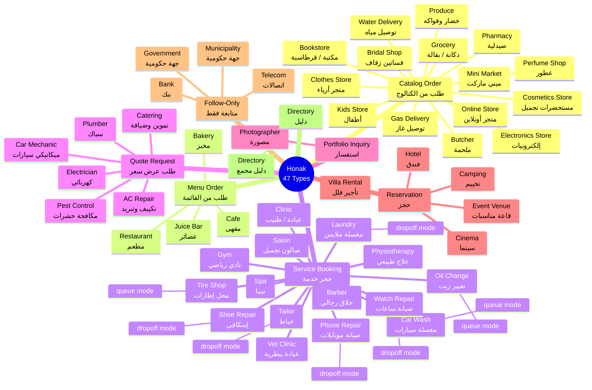
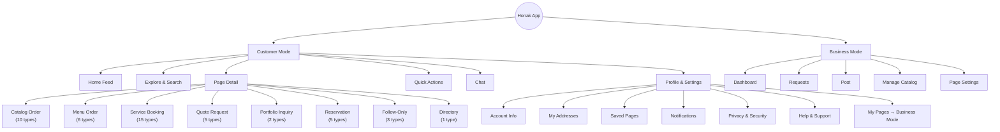
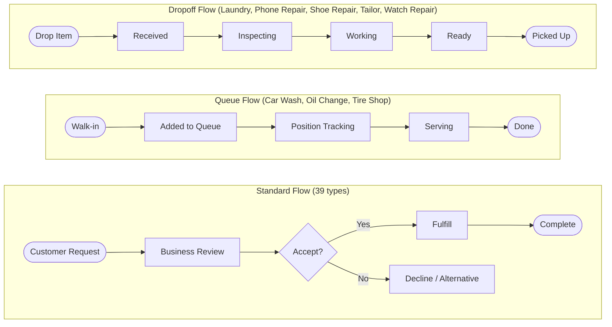

# Honak — Complete App Feature Map

> Auto-generated by `dart run tool/generate_business_map.dart`
> 51 business types across 8 archetypes
> Last generated: 2026-02-15

---

## Business Type Hierarchy



## App Structure



## Tracking Modes



---

## Architecture Overview

```
BusinessTypeConfig (27 fields)
  ├── Archetype (8 fixed patterns)       ← interaction model
  ├── Features (toggles)                  ← capabilities
  ├── Dashboard (sections + stats)         ← business home screen
  ├── ManageTabs (catalog structure)       ← what business edits
  ├── OrderLabels (AR strings)             ← request flow wording
  ├── ItemManagement (fields + properties) ← catalog item shape
  ├── Coverage (model + granularity)       ← delivery/service area
  ├── TeamRoles (suggested + permissions)  ← who does what
  └── Insights (sections + cards)          ← analytics view
```

**Config layers**: Archetype default → Type-specific overrides → Runtime state

### Archetypes

| Archetype | Arabic | Customer Action | Approval | Coverage | Date | Types |
|-----------|--------|-----------------|----------|----------|------|-------|
| Catalog Order | طلب من الكتالوج | "I want these items" | auto | deliveryZone | none | 15 |
| Menu Order | طلب من القائمة | "I want these dishes" | auto | deliveryZone | none | 4 |
| Service Booking | حجز خدمة | "I want this service at this time" | manual | none | required | 15 |
| Quote Request | طلب عرض سعر | "I have this problem" | manual | serviceArea | optional | 6 |
| Portfolio Inquiry | استفسار | "I want something like this" | manual | serviceArea | optional | 1 |
| Reservation | حجز | "I want to book a space" | manual | none | required | 5 |
| Follow-Only | متابعة فقط | "Just updates/info" | manual | none | none | 4 |
| Directory | دليل | "What's inside?" | manual | none | none | 1 |

---

## Part 1: Customer Experience

### 1.1 Guest (No Login)

Guests can browse but not interact:

| Screen | What They See | What They Cannot Do |
|--------|-------------|---------------------|
| **Home** | Feed posts from promoted pages, promo banners | Follow pages, see personalized feed |
| **Explore** | Category grid, search, page cards, filters | — (full access) |
| **Page Detail** | Full page with all sections (hero, items, posts, info) | Place orders, send requests, chat |
| **Product Detail** | Item photos, price, description, variants | Add to cart |
| **Quick Actions** | Login prompt | Any actions |
| **Chat** | Login prompt | Any chat |
| **Profile** | Login prompt | Any profile features |

**Login trigger**: Any interaction attempt (follow, order, chat, save) shows login prompt sheet.

### 1.2 Logged-In Customer

| Screen | Features |
|--------|----------|
| **Home (Feed)** | Chronological posts from followed pages, promo banners, "Near You" discovery |
| **Explore** | Categories, search, filters, page cards with follow button |
| **Quick Actions** | Shortcuts per business type (reorder, rebook) |
| **Chat** | Active conversations with businesses, message + photo support |
| **Profile** | 7 menu items: Saved, Addresses, Account Info, Notifications, Privacy, Language, Help |
| **Profile Sub-Screens** | AccountInfo, MyAddresses (CRUD), SavedPages, NotificationPrefs, PrivacySecurity (+ delete account), HelpSupport (FAQ + report) |
| **Page Detail** | Full page + CTA button + follow + save + chat + share |
| **Order/Request Flow** | Varies by archetype (see below) |
| **Order Tracking** | Real-time status updates, chat with business |
| **Business Pages** | "My Pages" section in profile → tap to switch to business mode |

### 1.3 Per Archetype — What Customer Sees on Page

#### Catalog Order (طلب من الكتالوج)

**Customer action**: "I want these items"

**Page sections**:
- Hero (cover + logo + stats)
- Product grid with categories & filters
- Price + image + name per product
- Add to cart button
- Cart summary & checkout
- Delivery zone selector
- Posts tab (feed from page)
- Info tab (about, hours, location)

**Flow**: Browse catalog → Add to cart → Select delivery → Confirm order → Track

**Types**: مكتبة / قرطاسية (Bookstore) · فساتين زفاف (Bridal Shop) · ملحمة (Butcher) · متجر أزياء (Clothes Store) · مستحضرات تجميل (Cosmetics Store) · إلكترونيات (Electronics Store) · توصيل غاز (Gas Delivery) · دكانة / بقالة (Grocery) · أطفال (Kids Store) · ميني ماركت (Mini Market) · متجر أونلاين (Online Store) · عطور (Perfume Shop) · صيدلية (Pharmacy) · خضار وفواكه (Produce) · توصيل مياه (Water Delivery)

#### Menu Order (طلب من القائمة)

**Customer action**: "I want these dishes"

**Page sections**:
- Hero (cover + logo + stats)
- Menu with category tabs
- Items with modifiers (size, extras)
- Add to cart with customization
- Cart summary & checkout
- Posts tab
- Info tab (hours, location, menu PDF)

**Flow**: Browse menu → Customize (size/extras) → Cart → Confirm → Track

**Types**: مخبز (Bakery) · مقهى (Cafe) · عصائر (Juice Bar) · مطعم (Restaurant)

#### Service Booking (حجز خدمة)

**Customer action**: "I want this service at this time"

**Page sections**:
- Hero (cover + logo + stats)
- Services list with durations & prices
- Team members (optional selection)
- Date & time picker
- Booking summary & confirm
- Posts tab
- Info tab (hours, team, location)

**Flow**: Pick service → Pick team member (optional) → Pick date/time → Confirm → Await approval

**Types**: حلاق رجالي (Barber) · مغسلة سيارات (Car Wash) · عيادة / طبيب (Clinic) · نادي رياضي (Gym) · مغسلة ملابس (Laundry) · صيانة موبايلات (Phone Repair) · تغيير زيت (Oil Change) · علاج طبيعي (Physiotherapy) · صالون تجميل (Salon) · إسكافي (Shoe Repair) · سبا (Spa) · خياط (Tailor) · محل إطارات (Tire Shop) · عيادة بيطرية (Vet Clinic) · صيانة ساعات (Watch Repair)

#### Quote Request (طلب عرض سعر)

**Customer action**: "I have this problem"

**Page sections**:
- Hero (cover + logo + stats)
- Service categories
- Quote request form
- Photo upload
- Urgency selector
- Posts tab
- Info tab (coverage area, hours)

**Flow**: Describe problem → Attach photos → Set urgency → Submit → Business sends quote → Accept/decline

**Types**: تكييف وتبريد (AC Repair) · ميكانيكي سيارات (Car Mechanic) · تموين وضيافة (Catering) · كهربائي (Electrician) · مكافحة حشرات (Pest Control) · سباك (Plumber)

#### Portfolio Inquiry (استفسار)

**Customer action**: "I want something like this"

**Page sections**:
- Hero (cover + logo + stats)
- Portfolio gallery (masonry grid)
- Past work showcase
- Ready-made items (optional)
- Inquiry / custom order form
- Posts tab
- Info tab (about, pricing, coverage)

**Flow**: Browse portfolio → "I want something like this" → Describe request → Submit → Business responds with quote

**Types**: مصورة (Photographer)

#### Reservation (حجز)

**Customer action**: "I want to book a space"

**Page sections**:
- Hero (cover + logo + stats)
- Spaces/rooms with photos & capacity
- Calendar / date range picker
- Guest count selector
- Amenities checklist
- Safety disclaimers
- Reservation summary & confirm
- Posts tab
- Info tab (location, rules, policies)

**Flow**: Browse spaces → Pick dates → Set guest count → Review rules → Confirm → Await approval → Deposit

**Types**: تخييم (Camping) · سينما (Cinema) · قاعة مناسبات (Event Venue) · فندق (Hotel) · تأجير فلل (Villa Rental)

#### Follow-Only (متابعة فقط)

**Customer action**: "Just updates/info"

**Page sections**:
- Hero (cover + logo + stats)
- Posts feed (announcements, updates)
- Links section (website, social)
- Info tab (about, contact, hours)

**Flow**: Follow page → See posts in home feed → Contact via chat or phone

**Types**: بنك (Bank) · جهة حكومية (Government) · جهة حكومية (Municipality) · اتصالات (Telecom)

#### Directory (دليل)

**Customer action**: "What's inside?"

**Page sections**:
- Hero (cover + logo + stats)
- Tenant directory (searchable grid)
- Floor/category filter
- Tenant cards → link to tenant pages
- Amenities & facilities
- Posts tab
- Info tab (location, floors, hours)

**Flow**: Browse directory → Filter by floor/category → Tap tenant → View tenant page

**Types**: دليل مجمع (Directory)

---

## Part 2: Business Experience

### 2.1 Common to All Business Types

| Component | Description |
|-----------|-------------|
| **App Bar** | Page avatar + name + verified badge + archetype subtitle, dropdown to switch pages, "← عميل" chip to switch to customer mode, notification bell with badge |
| **Bottom Tabs** | Up to 5 tabs: Dashboard, Requests, Post, Manage, Settings — visibility driven by archetype (`supportsRequests`, `hasCatalog`) |
| **Dashboard** | Config-driven sections (stats, revenue, pending, queue, etc.) + quick actions |
| **Requests** | Incoming/accepted/completed tabs with archetype-specific labels |
| **Post** | Create posts (product, offer, update, photo) visible to followers |
| **Manage** | Config-driven tabs for catalog/menu/services/portfolio management |
| **Settings** | Page settings — status, info, operations, team, marketing (no account tab — managed in customer mode) |

### 2.2 Per Archetype — Business Owner View

#### Catalog Order (طلب من الكتالوج)

| Aspect | Details |
|--------|---------|
| **Tabs visible** | Dashboard, Requests, Manage, Post, Settings |
| **Dashboard sections** | stats, revenue, pending, actions, bestSellers, lowStock |
| **Manage tabs** | items (المنتجات), packages (الباقات) |
| **Request labels** | طلب |
| **Coverage** | deliveryZone |
| **Date selection** | none |
| **Approval mode** | auto |
| **Permissions** | manageCatalog, manageOrders, respondChat, postUpdates, viewInsights, manageSettings, manageTeam |

**Settings sections**:
- Page status & relocation
- Page info (name, logo, description)
- Branches & locations
- Payment methods
- Operations (engagement, approval, return policy, coverage, catalog strategy)
- Team management
- Marketing & sharing
- Tools (catalog sync)

#### Menu Order (طلب من القائمة)

| Aspect | Details |
|--------|---------|
| **Tabs visible** | Dashboard, Requests, Manage, Post, Settings |
| **Dashboard sections** | stats, revenue, queue, pending, actions, bestSellers, unavailable |
| **Manage tabs** | menu (القائمة), packages (الباقات) |
| **Request labels** | أطلب |
| **Coverage** | deliveryZone |
| **Date selection** | none |
| **Approval mode** | auto |
| **Permissions** | manageCatalog, manageOrders, respondChat, postUpdates, viewInsights, manageSettings, manageTeam |

**Settings sections**:
- Page status & relocation
- Page info
- Branches & locations
- Payment methods
- Operations (engagement, approval, return policy, coverage, catalog strategy)
- Team management
- Marketing & sharing
- Tools (catalog sync)

#### Service Booking (حجز خدمة)

| Aspect | Details |
|--------|---------|
| **Tabs visible** | Dashboard, Requests, Manage, Post, Settings |
| **Dashboard sections** | stats, revenue, nextAppt, schedule, pending, actions |
| **Manage tabs** | services (الخدمات), packages (الباقات) |
| **Request labels** | حجز |
| **Coverage** | none |
| **Date selection** | required |
| **Approval mode** | manual |
| **Permissions** | manageAvailability, manageCatalog, manageOrders, respondChat, postUpdates, viewInsights, manageSettings, manageTeam |

**Settings sections**:
- Page status & relocation
- Page info
- Branches & locations
- Payment methods
- Operations (engagement, approval, cancellation, intake questions)
- Team management
- Availability & schedule
- Marketing & sharing
- Tools (calendar sync)

#### Quote Request (طلب عرض سعر)

| Aspect | Details |
|--------|---------|
| **Tabs visible** | Dashboard, Requests, Manage, Post, Settings |
| **Dashboard sections** | stats, quotes, pending, actions, revenue |
| **Manage tabs** | services (الخدمات), pastWork (أعمالنا), priceRange (الأسعار) |
| **Request labels** | طلب معاينة |
| **Coverage** | serviceArea |
| **Date selection** | optional |
| **Approval mode** | manual |
| **Permissions** | manageOrders, respondChat, postUpdates, viewInsights, manageSettings, manageTeam |

**Settings sections**:
- Page status & relocation
- Page info
- Location & service area
- Payment methods
- Operations (engagement, approval, quote form questions)
- Team management
- Marketing & sharing

#### Portfolio Inquiry (استفسار)

| Aspect | Details |
|--------|---------|
| **Tabs visible** | Dashboard, Requests, Manage, Post, Settings |
| **Dashboard sections** | stats, pending, actions, revenue |
| **Manage tabs** | portfolio (المعرض), pastWork (أعمالنا), priceRange (الأسعار) |
| **Request labels** | استفسار |
| **Coverage** | serviceArea |
| **Date selection** | optional |
| **Approval mode** | manual |
| **Permissions** | manageOrders, respondChat, postUpdates, viewInsights, manageSettings, manageTeam |

**Settings sections**:
- Page status & relocation
- Page info
- Location & service area
- Payment methods
- Operations (engagement, approval)
- Team management
- Marketing & sharing

#### Reservation (حجز)

| Aspect | Details |
|--------|---------|
| **Tabs visible** | Dashboard, Requests, Manage, Post, Settings |
| **Dashboard sections** | stats, occupancy, upcomingRes, pending, actions, revenue |
| **Manage tabs** | spaces (المساحات), packages (الباقات), seasonalPricing (التسعير الموسمي) |
| **Request labels** | حجز |
| **Coverage** | none |
| **Date selection** | required |
| **Approval mode** | manual |
| **Permissions** | manageAvailability, manageCatalog, manageOrders, respondChat, postUpdates, viewInsights, manageSettings, manageTeam |

**Settings sections**:
- Page status & relocation
- Page info
- Branches & locations
- Payment methods
- Operations (engagement, approval, cancellation, venue settings)
- Safety & disclaimers
- Post-booking steps
- Team management
- Availability & schedule
- Marketing & sharing
- Tools (calendar sync)

#### Follow-Only (متابعة فقط)

| Aspect | Details |
|--------|---------|
| **Tabs visible** | Dashboard, Post, Settings |
| **Dashboard sections** | stats, posts, actions |
| **Manage tabs** | N/A |
| **Request labels** | N/A (no requests) |
| **Coverage** | none |
| **Date selection** | none |
| **Approval mode** | manual |
| **Permissions** | postUpdates, respondChat, viewInsights, manageSettings |

**Settings sections**:
- Page status
- Page info
- Location
- Alert management
- Team management
- Marketing & sharing

#### Directory (دليل)

| Aspect | Details |
|--------|---------|
| **Tabs visible** | Dashboard, Post, Settings |
| **Dashboard sections** | stats, recentlyLinked, actions |
| **Manage tabs** | N/A |
| **Request labels** | N/A (no requests) |
| **Coverage** | none |
| **Date selection** | none |
| **Approval mode** | manual |
| **Permissions** | manageCatalog, respondChat, postUpdates, viewInsights, manageSettings, manageTeam |

**Settings sections**:
- Page status
- Page info
- Location
- Tenant management
- Team management
- Marketing & sharing

---

## Part 3: Full Type Matrix

| Type ID | Arabic | English | Archetype | Category | Tracking | Key Features |
|---------|--------|---------|-----------|----------|----------|-------------|
| bookstore | مكتبة / قرطاسية | Bookstore | catalog_order | Retail & Shopping | standard | inventory_tracking, delivery_zones |
| bridal_shop | فساتين زفاف | Bridal Shop | catalog_order | Retail & Shopping | standard | (archetype defaults) |
| butcher | ملحمة | Butcher | catalog_order | Food & Dining | standard | (archetype defaults) |
| clothes_store | متجر أزياء | Clothes Store | catalog_order | Retail & Shopping | standard | size_variants, color_variants, inventory_tracking |
| cosmetics_store | مستحضرات تجميل | Cosmetics Store | catalog_order | Beauty | standard | (archetype defaults) |
| electronics_store | إلكترونيات | Electronics Store | catalog_order | Retail & Shopping | standard | inventory |
| gas_delivery | توصيل غاز | Gas Delivery | catalog_order | Delivery | standard | recurring_orders, subscriptions, delivery_zones, delivery_time_slots |
| grocery | دكانة / بقالة | Grocery | catalog_order | Grocery | standard | (archetype defaults) |
| kids_store | أطفال | Kids Store | catalog_order | Retail & Shopping | standard | (archetype defaults) |
| mini_market | ميني ماركت | Mini Market | catalog_order | Retail & Shopping | standard | inventory |
| online_store | متجر أونلاين | Online Store | catalog_order | Retail & Shopping | standard | size_variants, color_variants, inventory_tracking, delivery_zones |
| perfume_shop | عطور | Perfume Shop | catalog_order | Retail & Shopping | standard | (archetype defaults) |
| pharmacy | صيدلية | Pharmacy | catalog_order | Health | standard | inventory |
| produce | خضار وفواكه | Produce | catalog_order | Food & Dining | standard | (archetype defaults) |
| water_delivery | توصيل مياه | Water Delivery | catalog_order | Delivery | standard | recurring_orders, subscriptions, punch_cards, delivery_zones, delivery_time_slots |
| bakery | مخبز | Bakery | menu_order | Food & Dining | standard | menu_modifiers, delivery_zones |
| cafe | مقهى | Cafe | menu_order | Food & Dining | standard | menu_modifiers, punch_cards |
| juice_bar | عصائر | Juice Bar | menu_order | Food & Dining | standard | (archetype defaults) |
| restaurant | مطعم | Restaurant | menu_order | Food & Dining | standard | menu_modifiers, delivery_zones, table_reservation, punch_cards |
| barber | حلاق رجالي | Barber | service_booking | Beauty | standard | service_duration, team_display, punch_cards |
| car_wash | مغسلة سيارات | Car Wash | service_booking | Auto | queue | service_duration, packages |
| clinic | عيادة / طبيب | Clinic | service_booking | Health | standard | service_duration, team_display, multi_location |
| gym | نادي رياضي | Gym | service_booking | Fitness | standard | service_duration, subscriptions |
| laundry | مغسلة ملابس | Laundry | service_booking | Home Services | dropoff | service_duration |
| mobile_repair | صيانة موبايلات | Phone Repair | service_booking | Electronics | dropoff | service_duration |
| oil_change | تغيير زيت | Oil Change | service_booking | Auto | queue | service_duration, packages |
| physiotherapy | علاج طبيعي | Physiotherapy | service_booking | Health | standard | (archetype defaults) |
| salon | صالون تجميل | Salon | service_booking | Beauty | standard | service_duration, team_display, subscriptions, punch_cards, loyalty_points |
| shoe_repair | إسكافي | Shoe Repair | service_booking | Services | dropoff | service_duration |
| spa | سبا | Spa | service_booking | Beauty | standard | (archetype defaults) |
| tailor | خياط | Tailor | service_booking | Services | dropoff | service_duration |
| tire_shop | محل إطارات | Tire Shop | service_booking | Auto | queue | service_duration, packages |
| vet_clinic | عيادة بيطرية | Vet Clinic | service_booking | Health | standard | (archetype defaults) |
| watch_repair | صيانة ساعات | Watch Repair | service_booking | Services | dropoff | service_duration |
| ac_repair | تكييف وتبريد | AC Repair | quote_request | Home Services | standard | (archetype defaults) |
| car_mechanic | ميكانيكي سيارات | Car Mechanic | quote_request | Auto | standard | (archetype defaults) |
| catering | تموين وضيافة | Catering | quote_request | Food & Dining | standard | (archetype defaults) |
| electrician | كهربائي | Electrician | quote_request | Home Services | standard | (archetype defaults) |
| pest_control | مكافحة حشرات | Pest Control | quote_request | Home Services | standard | (archetype defaults) |
| plumber | سباك | Plumber | quote_request | Home Services | standard | quote_form, service_area |
| photographer | مصورة | Photographer | portfolio_inquiry | Creative | standard | portfolio_gallery, ready_made_items, custom_order |
| camping | تخييم | Camping | reservation | Stays | standard | per_night_pricing, amenities_checklist, photo_gallery, outdoor_space |
| cinema | سينما | Cinema | reservation | Entertainment | standard | (archetype defaults) |
| event_venue | قاعة مناسبات | Event Venue | reservation | Entertainment | standard | spaces, reservation_form, photo_gallery |
| hotel | فندق | Hotel | reservation | Stays | standard | per_night_pricing, amenities_checklist, photo_gallery |
| villa_rental | تأجير فلل | Villa Rental | reservation | Stays | standard | per_night_pricing, amenities_checklist, photo_gallery, house_rules, checkin_checkout, max_guests |
| bank | بنك | Bank | follow_only | Services | standard | posts_only, links |
| government | جهة حكومية | Government | follow_only | Government | standard | alerts |
| municipality | جهة حكومية | Municipality | follow_only | Government | standard | (archetype defaults) |
| telecom | اتصالات | Telecom | follow_only | Services | standard | (archetype defaults) |
| directory | دليل مجمع | Directory | directory | Shopping Centers | standard | tenant_directory, floor_management, amenities_checklist |

---

## Part 4: Special Tracking Modes

Beyond the standard request → response flow, some types have special tracking:

### Queue Mode

Customer walks in → business adds to live queue → customer tracks position → served

**Types**: مغسلة سيارات (car_wash), تغيير زيت (oil_change), محل إطارات (tire_shop)

**Business gets**:
- Live queue board with drag-to-reorder
- Quick-add customer (walk-up)
- Queue entry cards with status transitions
- Queue dashboard widget on home
- Activity log per entry

**Customer gets**:
- Queue position tracker
- Estimated wait time
- "Ready" notification
- Cancel from queue

### Dropoff Mode

Customer drops off item → business tracks repair/cleaning status → customer picks up

**Types**: مغسلة ملابس (laundry), صيانة موبايلات (mobile_repair), إسكافي (shoe_repair), خياط (tailor), صيانة ساعات (watch_repair)

**Business gets**:
- Dropoff board (ticket-based tracking)
- Quick-add ticket with item photos
- Status pipeline (received → inspecting → working → ready → picked_up)
- Info capture templates (per business type)
- Dropoff dashboard widget
- Activity log per ticket

**Customer gets**:
- Ticket status tracker ("تتبع قطعك")
- Status update notifications
- "Ready for pickup" notification
- Item photos and notes

---

## Part 5: Adding a New Business Type

### If it fits an existing archetype (most cases):

| Step | File | What |
|------|------|------|
| 1 | `lib/config/types/{category}_types.dart` | Add `createType()` entry (~50 lines) |
| 2 | `lib/config/types/{category}_types.dart` | Export in barrel file |
| 3 | `lib/config/business_type_registry.dart` | Add to `_allTypes` list |
| 4 | `assets/api/pages/page_{slug}.json` | Page fixture |
| 5 | `assets/api/products/items_{type_id}.json` | Items fixture (if has catalog) |
| 6 | `assets/api/business/dashboard/{type_id}.json` | Dashboard fixture |
| 7 | Run `dart run tool/generate_fixtures.dart` | Regenerate derived files |
| 8 | Update user fixture in `assets/api/users/` | Add page to demo account |

**Total: ~4-5 files, 0 new Dart widget code**

### If it needs custom features beyond the archetype:

Each genuinely new capability (not covered by existing widgets) needs:

| Layer | Files | Example |
|-------|-------|---------|
| Entity | 3 (`.dart` + `.freezed.dart` + `.g.dart`) | `visit_history.dart` |
| Provider | 1 | `visit_history_provider.dart` |
| Widget(s) | 2-8 | `visit_timeline.dart`, `visit_card.dart` |
| Page | 0-1 | Only if entirely new screen needed |

**Per custom feature: ~5-15 files**

### If it needs a new archetype (rare):

Everything above PLUS:
- New archetype enum value in `archetype.dart`
- New defaults file in `archetype_defaults/`
- New request flow widgets
- New page detail sections
- New manage page layout
- **~30-50+ files**

> In 49 types, we have NOT needed a 9th archetype. The 8 cover all known Jordan business patterns.

### Key Documents for Adding Types

| Document | What It Covers |
|----------|---------------|
| `docs/GUIDELINES.md` | Config-driven design rules, naming, component sharing |
| `docs/ARCHETYPES.md` | 8 archetypes in detail — flows, states, features |
| `docs/BUSINESS_TAXONOMY.md` | All ~160 types, categories, archetype mappings |
| `mobile/CLAUDE.md` | Build commands, architecture, fixture pipeline |
| This file (`BUSINESS_MAP.md`) | What each type currently has in the app |

